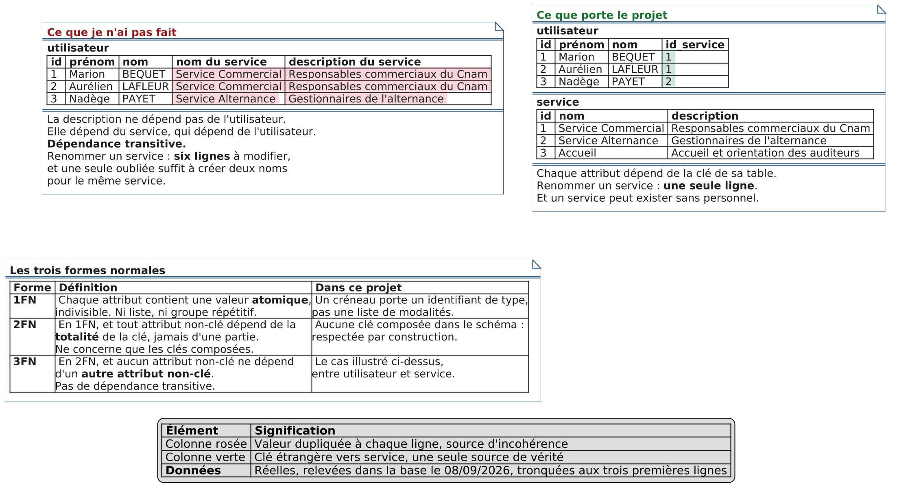

# Les trois formes normales, sur mes propres tables

Aide-mémoire de soutenance. Objectif : démontrer chaque forme en trente secondes sur une
table réelle du projet, pas sur un exemple de cours.

Toutes les données citées sont **relevées dans la base le 08/09/2026**. Toutes les tables et
colonnes nommées existent.

*Figure : en haut, à gauche la table `utilisateur` telle qu'elle aurait été si le nom du
service avait été dupliqué, à droite celle du projet, avec la clé étrangère vers `service`.
En dessous, la définition des trois formes normales et ce qu'elles donnent dans ce projet.
Régénération : `java -jar ~/plantuml.jar -tpng docs/preparation/troisieme-forme-normale.puml`*

---

## 1FN, l'atomicité

**Ce qui la respecte : `creneau.id_type_rdv`**

Un créneau a un type de rendez-vous, et un seul, porté par une clé étrangère vers
`type_rdv`. Données réelles :

| id | date_debut | id_type_rdv | libellé |
|---:|---|---:|---|
| 1 | 2026-08-07 08:00:00 | 2 | Visio |
| 2 | 2026-08-07 09:00:00 | 1 | Présentiel |
| 3 | 2026-08-07 10:00:00 | 2 | Visio |

Chaque cellule contient une valeur indivisible. Pas de liste, pas de séparateur.

**Le contre-exemple : ce que j'aurais pu écrire**

La tentation, quand on se dit « un créneau pourrait accepter plusieurs modalités » :

| id | date_debut | types |
|---:|---|---|
| 1 | 2026-08-07 08:00:00 | `visio,telephone` |
| 2 | 2026-08-07 09:00:00 | `presentiel` |
| 3 | 2026-08-07 10:00:00 | `visio, téléphone` |

**Trois problèmes concrets**

- **Filtrer devient faux.** L'écran des créneaux disponibles filtre par type. Avec une
  liste, il faudrait un `LIKE '%visio%'`, qui remonterait aussi `visioconference` et
  raterait la ligne 3 à cause de l'espace après la virgule.
- **La couleur ne peut plus venir de la donnée.** L'argument de la diapositive 32, « on
  ajoute un type sans toucher au code de présentation », s'effondre : plus de jointure
  possible vers `type_rdv.couleur_hex`.
- **Aucune intégrité.** Rien n'empêche d'écrire `visioo`. La clé étrangère, elle, le refuse.

**À dire en trente secondes**

> Un créneau porte un identifiant de type, pas une chaîne. C'est ce qui permet à mon filtre
> de fonctionner par jointure et à la couleur d'être une donnée métier plutôt qu'une
> constante de code.

---

## 2FN, la dépendance à la clé entière

**Le fait à annoncer d'emblée : aucune clé composée dans le schéma**

Vérifié sur les onze tables de la base. Toutes ont une clé primaire à **une seule colonne**,
`id` en entier auto-incrémenté, sauf `doctrine_migration_versions` qui utilise `version` et
qui appartient à Doctrine.

**Pourquoi la forme est alors respectée d'office**

La 2FN interdit qu'un attribut non-clé dépende d'une **partie seulement** de la clé
primaire. Cette violation suppose une clé composée : s'il n'y a qu'une colonne dans la clé,
il n'existe aucune partie dont dépendre. Toute table en 1FN dont la clé est simple est en
2FN par construction.

C'est une réponse plus solide qu'un exemple fabriqué. **Ne pas en inventer un.**

**Le contre-exemple, si le jury veut voir la mécanique**

Là où une clé composée aurait été tentante, c'est sur la réservation, en disant « un créneau
plus un auditeur identifient une réservation » :

| id_creneau | id_utilisateur | date_reservation | nom_auditeur |
|---:|---:|---|---|
| 20 | 7 | 2026-08-30 | Julie POTIER |
| 21 | 7 | 2026-09-01 | Julie POTIER |
| 22 | 9 | 2026-09-02 | Damien BOYER |

`nom_auditeur` ne dépend que de `id_utilisateur`, **la moitié de la clé**. Le nom est répété
à chaque réservation, et un changement de nom impose de corriger toutes les lignes ou de
vivre avec une incohérence.

Ce qui a été fait à la place : `reservation.id` est une clé technique simple, et le nom
reste dans `utilisateur`. Ce choix a aussi permis de faire évoluer la cardinalité lors de
DT-1, ce qu'une clé composée aurait figée.

---

## 3FN, pas de dépendance transitive

C'est le cas illustré par la figure en tête de ce document.

**Ce qui la respecte : `utilisateur.id_service`**

Un membre du personnel porte l'identifiant de son service, pas son nom :

| id | prénom | nom | id_service |
|---:|---|---|---:|
| 1 | Marion | BEQUET | 1 |
| 3 | Nadège | PAYET | 2 |
| 5 | Sabrina | HOARAU | 3 |

Et `service` porte ce qui dépend du service :

| id | nom | description |
|---:|---|---|
| 1 | Service Commercial | Responsables commerciaux du Cnam |
| 2 | Service Alternance | Gestionnaires de l'alternance |
| 3 | Accueil | Accueil et orientation des auditeurs |

**Le contre-exemple : la table fautive**

| id | prénom | nom | nom du service | description du service |
|---:|---|---|---|---|
| 1 | Marion | BEQUET | Service Commercial | Responsables commerciaux du Cnam |
| 2 | Aurélien | LAFLEUR | Service Commercial | Responsables commerciaux du Cnam |
| 3 | Nadège | PAYET | Service Alternance | Gestionnaires de l'alternance |

La description ne dépend pas de l'utilisateur : elle dépend du service, qui dépend de
l'utilisateur. **Dépendance transitive.**

**Le problème concret, en une phrase**

Renommer « Service Commercial » oblige à modifier deux lignes ici, **six dans le jeu réel**,
et il suffit d'en oublier une pour que le même service porte deux noms. Avec la clé
étrangère, on modifie **une seule ligne** dans `service`.

**À dire en trente secondes**

> Un utilisateur porte l'identifiant de son service, pas son nom. Renommer un service, c'est
> une ligne modifiée, pas six. Et un service peut exister sans personnel, ce qu'une
> duplication ne permettrait pas de représenter.

---

## Les deux entorses volontaires

Il y en a deux, assumées et documentées dans le code. **Les amener soi-même**, après avoir
démontré les trois formes.

### `journal_admin` : la 3FN enfreinte délibérément

Les colonnes `acteur_libelle` et `cible_libelle`, en `varchar(201)`, dupliquent le nom des
comptes alors que `acteur_id` et `cible_id` existent. C'est exactement le contre-exemple de
la 3FN, en pire : il n'y a même pas de clé étrangère.

Le commentaire de l'entité `src/Entity/JournalAdmin.php` l'écrit :

> Acteur et cible sont FIGÉS (id + libellé au moment de l'action), sans clé étrangère
> vivante : la trace survit donc au renommage ou à la suppression des comptes concernés, et
> son affichage ne nécessite aucun JOIN.

**Pourquoi c'est justifié ici, et seulement ici.** Un journal d'imputabilité doit dire ce
qui était vrai **au moment de l'action**. Si un compte change de nom, ou s'il est anonymisé
au titre du droit à l'effacement, une clé étrangère ferait afficher rétroactivement le
nouveau nom, ou ferait disparaître la trace. La normalisation garantirait la cohérence avec
le présent ; or on veut la fidélité au passé. C'est le raisonnement d'une facture, qui fige
l'adresse du client au jour de l'émission.

**La contrepartie est traitée** : le nominatif figé relève du RGPD, donc la conservation est
bornée à **douze mois** par la constante `DUREE_CONSERVATION_MOIS` et la purge automatisée
`app:purger-journal`, tracée en DT-15.

### `historique_utilisateur` : la 1FN mise sous tension

Les colonnes `ancienne_valeur` et `nouvelle_valeur`, en `varchar(255)`, stockent la valeur
de **n'importe quel champ**, désigné par `champ_modifie`. Une même colonne peut donc
contenir une adresse, un rôle ou un booléen.

Ce n'est pas une violation stricte de la 1FN, chaque cellule reste atomique, mais c'est un
**domaine hétérogène** : la colonne n'a pas de type sémantique unique. C'est le motif dit
entité-attribut-valeur. La justification est la même que pour le journal : figer ce qui a
changé, sans jointure et sans dépendre de la structure actuelle de `utilisateur`.

---

## La phrase qui referme

> Mon schéma est en troisième forme normale, avec deux exceptions volontaires que je peux
> justifier : le journal d'administration et l'historique utilisateur figent les libellés au
> lieu de les référencer. Une trace doit dire ce qui était vrai au moment de l'action, pas
> ce qui est vrai aujourd'hui. C'est une dénormalisation choisie, documentée dans le code,
> et sa contrepartie RGPD est traitée par une conservation limitée à douze mois.

Un jury retient mieux « je sais quand ne pas normaliser » que « j'ai tout normalisé ».
